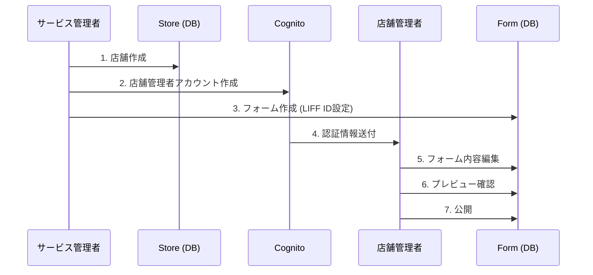
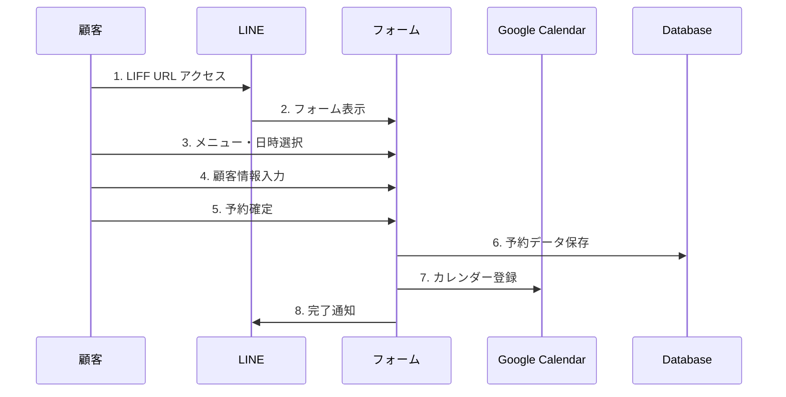

# LINE予約フォーム管理システム 仕様書

## 📋 システム概要

LINE LIFFを活用したマルチテナント予約フォーム管理システムです。サービス管理者が複数の店舗を管理し、各店舗の管理者がフォームを設定・管理し、顧客がLINE上で予約を行うことができます。

### システムの役割
- **サービス管理者**: 全店舗の管理、フォームの追加・削除
- **店舗管理者**: 自店舗のフォーム内容の編集・管理
- **顧客**: LINE上での予約フォーム利用

## 🎯 主要機能

### 1. サービス管理者機能

#### 1.1 店舗管理
- **店舗追加**: 新規店舗の登録と店舗管理者アカウント作成
- **店舗一覧**: 全店舗の情報とフォーム数の表示
- **店舗詳細**: 個別店舗の詳細情報と関連フォーム管理
- **店舗削除**: 店舗と関連フォームの一括削除

#### 1.2 フォーム管理
- **フォーム作成**: 店舗に紐づくフォームの新規作成
- **LIFF ID設定**: LINE連携用のLIFF ID管理
- **Google Calendar API設定**: カレンダー連携設定
- **URL生成**: 顧客用・管理者用URLの自動生成

#### 1.3 システム設定
- **権限管理**: 店舗管理者の権限設定
- **全体統計**: 全店舗の利用状況監視

### 2. 店舗管理者機能

#### 2.1 フォーム基本設定
- **基本情報**: 店舗名、フォーム名、テーマカラーの設定
- **ロゴ設定**: 店舗ロゴ画像のアップロード
- **性別選択**: 性別による表示制御の設定

#### 2.2 メニュー・カテゴリ管理
- **カテゴリ作成**: メニューカテゴリの追加・編集・削除
- **メニュー管理**: メニューアイテムの詳細設定
  - 名前、価格、所要時間
  - メニュー画像のアップロード
  - 説明文、施術情報
- **性別フィルタリング**: 性別によるメニュー表示制御
- **オプション設定**: 追加オプションメニューの管理

#### 2.3 営業設定
- **営業時間**: 曜日別の営業時間設定
- **定休日**: 休業日の設定
- **予約ルール**: 事前予約可能日数の設定

#### 2.4 来店オプション設定
- **来店回数**: 初回・リピート等の設定
- **所要時間**: オプション別の時間設定
- **料金設定**: オプション料金の管理

#### 2.5 ワークフロー管理
- **ドラフト保存**: 変更内容の一時保存
- **プレビュー**: 顧客画面での表示確認
- **公開**: ドラフトの本番反映
- **ドラフト破棄**: 変更の取り消し

### 3. 顧客向け機能

#### 3.1 基本操作
- **性別選択**: 設定に応じたメニューフィルタリング
- **来店オプション選択**: 来店回数・時間の選択
- **メニュー選択**: 画像付きメニューからの選択
- **オプション選択**: 追加サービスの選択

#### 3.2 予約機能
- **日時選択**: カレンダーからの予約日時選択
- **顧客情報入力**: 名前、電話番号、要望等の入力
- **確認画面**: 選択内容の最終確認
- **予約完了**: LINE通知とカレンダー連携

#### 3.3 UI/UX
- **モバイル最適化**: LINE内ブラウザ対応
- **レスポンシブデザイン**: 各種画面サイズ対応
- **直感的操作**: タップ・スワイプ操作対応

## 🏗 システム構成

### アクセスURL構造
```
サービス管理者:
- /admin                    # 店舗一覧
- /admin/{storeId}          # 個別店舗管理 (例: /admin/st0001)

店舗管理者:
- /{storeId}/admin          # 店舗ダッシュボード (例: /st0001/admin)
- /{storeId}/forms/{formId} # フォーム編集 (例: /st0001/forms/abc123)
- /{storeId}/forms/{formId}/preview # プレビュー (例: /st0001/forms/abc123/preview)

顧客:
- /form/{formId}            # 予約フォーム (例: /form/abc123)
```

### データ構造

#### 店舗 (Store)
```typescript
interface Store {
  id: string;                 // st0001
  name: string;               // 店舗名
  owner_name: string;         // オーナー名
  owner_email: string;        // メールアドレス
  phone?: string;             // 電話番号
  address?: string;           // 住所
  website_url?: string;       // ウェブサイト
  description?: string;       // 説明
  status: 'active' | 'inactive';
  created_at: string;
  updated_at: string;
}
```

#### フォーム (Form)
```typescript
interface Form {
  id: string;                 // 16文字のランダム文字列
  store_id: string;           // 所属店舗ID
  config: FormConfig;         // フォーム設定
  draft_config?: FormConfig;  // ドラフト設定
  status: 'active' | 'inactive';
  draft_status: 'none' | 'draft';
  created_at: string;
  updated_at: string;
  last_published_at?: string;
}
```

#### フォーム設定 (FormConfig)
```typescript
interface FormConfig {
  basic_info: {
    form_name: string;        // フォーム名
    store_name: string;       // 店舗名
    liff_id: string;          // LIFF ID (サービス管理者が設定)
    theme_color: string;      // テーマカラー
    logo_url?: string;        // ロゴURL
  };
  visit_options: VisitOption[];     // 来店オプション
  gender_selection: GenderSelection; // 性別選択設定
  menu_structure: MenuStructure;    // メニュー構成
  calendar_settings: CalendarSettings; // カレンダー設定
  ui_settings: UISettings;          // UI設定
  validation_rules: ValidationRules; // バリデーション設定
}
```

## 🔐 権限・セキュリティ

### 認証システム
- **Supabase Auth**: ユーザー認証・認可
- **Row Level Security**: データベースレベルのアクセス制御
- **JWT Token**: APIアクセス認証

### 権限レベル
```typescript
type UserRole = 'service_admin' | 'store_admin';

interface User {
  id: string;
  email: string;
  role: UserRole;
  store_id?: string;  // store_adminの場合のみ
  permissions: string[];
}
```

### セキュリティ要件
- **HTTPS通信**: 全通信の暗号化
- **CORS設定**: 適切なオリジン制御
- **入力検証**: XSS・SQLインジェクション対策
- **レート制限**: Supabase内蔵制限機能
- **Row Level Security**: データベースレベルのセキュリティ

## 📱 対応環境

### ブラウザ対応
- **LINE内ブラウザ**: iOS/Android対応
- **モバイルブラウザ**: Safari, Chrome (iOS/Android)
- **デスクトップブラウザ**: Chrome, Firefox, Safari, Edge

### 画面サイズ対応
- **スマートフォン**: 375px〜414px
- **タブレット**: 768px〜1024px
- **デスクトップ**: 1024px以上

## 🔄 ワークフロー

### 店舗・フォーム作成フロー


### 予約フロー


## 📊 非機能要件

### パフォーマンス
- **ページ読み込み時間**: 3秒以内
- **API応答時間**: 500ms以内
- **同時接続数**: 1000ユーザー対応

### 可用性
- **稼働率**: 99.9%以上
- **メンテナンス時間**: 月次2時間以内

### スケーラビリティ
- **店舗数**: 1000店舗対応
- **フォーム数**: 店舗あたり10フォーム
- **月間予約数**: 100,000件対応

## 🧪 テスト要件

### テスト種類
- **単体テスト**: コンポーネント・関数レベル
- **統合テスト**: API・データベース連携
- **E2Eテスト**: ユーザーシナリオ全体
- **パフォーマンステスト**: 負荷・ストレステスト

### テストカバレッジ
- **コードカバレッジ**: 80%以上
- **ブランチカバレッジ**: 70%以上

## 📋 運用要件

### 監視・ログ
- **Supabase Dashboard**: データベース監視
- **Vercel Analytics**: アプリケーション監視
- **Sentry**: エラー監視・トラッキング
- **Next.js Logs**: アプリケーションログ

### バックアップ
- **Supabase**: 自動バックアップ（Point-in-time recovery）
- **Vercel**: Git連携による自動バックアップ
- **復旧時間**: RTO 1時間、RPO 15分

### 運用手順
- **デプロイ手順**: Vercel自動デプロイ（Git連携）
- **障害対応**: Sentry + Slack通知
- **定期メンテナンス**: Supabase自動メンテナンス
