# LINE予約フォーム管理システム 技術設計書

## 🏗 システムアーキテクチャ概要

### 全体構成図（Next.js + Supabase）
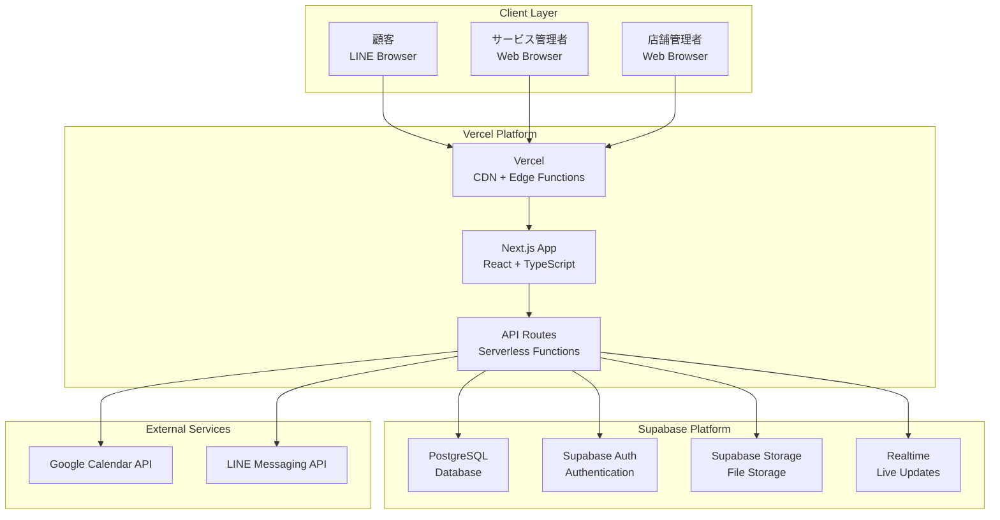

## 🌐 フロントエンド設計

### Next.js App Router 構成
```mermaid
graph TB
    subgraph "Next.js App"
        APP[app/layout.tsx<br/>Root Layout]
        
        subgraph "Service Admin"
            SADMIN[app/admin/page.tsx<br/>店舗一覧・管理]
            STOADMIN[app/admin/[storeId]/page.tsx<br/>個別店舗管理]
        end
        
        subgraph "Store Admin"
            DASH[app/[storeId]/admin/page.tsx<br/>フォーム一覧]
            FMGMT[app/[storeId]/forms/[formId]/page.tsx<br/>フォーム編集]
            FPREV[app/[storeId]/forms/[formId]/preview/page.tsx<br/>プレビュー]
        end
        
        subgraph "Customer"
            CFORM[app/form/[formId]/page.tsx<br/>予約フォーム]
        end
        
        subgraph "API Routes"
            STOREAPI[app/api/stores/route.ts]
            FORMAPI[app/api/forms/route.ts]
            AUTHAPI[app/api/auth/route.ts]
        end
        
        subgraph "Shared Components"
            LAYOUT[components/Layout]
            FCOMP[components/Form]
            UI[components/UI]
        end
    end

    APP --> SADMIN
    APP --> STOADMIN
    APP --> DASH
    APP --> FMGMT
    APP --> FPREV
    APP --> CFORM
    
    SADMIN --> STOREAPI
    DASH --> FORMAPI
    FMGMT --> FORMAPI
    CFORM --> FORMAPI
```

### URL設計
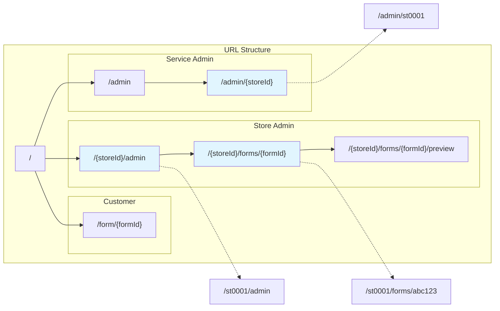

### 状態管理設計
```mermaid
graph TB
    subgraph "Data Layer"
        SUPABASE[Supabase Client]
        POSTGRES[PostgreSQL]
        AUTH[Supabase Auth]
    end

    subgraph "Service Layer"
        API_ROUTES[Next.js API Routes]
        SERVICES[Service Functions]
        HOOKS[Custom Hooks]
    end

    subgraph "Component Layer"
        PAGES[Page Components]
        COMPONENTS[UI Components]
        CONTEXT[React Context]
    end

    subgraph "State Management"
        SWR[SWR/TanStack Query]
        ZUSTAND[Zustand (Global State)]
        REACT_STATE[React State]
    end

    SUPABASE --> POSTGRES
    SUPABASE --> AUTH
    API_ROUTES --> SUPABASE
    SERVICES --> API_ROUTES
    HOOKS --> SERVICES
    HOOKS --> SWR
    PAGES --> HOOKS
    PAGES --> ZUSTAND
    COMPONENTS --> REACT_STATE
    COMPONENTS --> CONTEXT
```

## ⚙️ バックエンド設計

### Next.js API Routes 設計
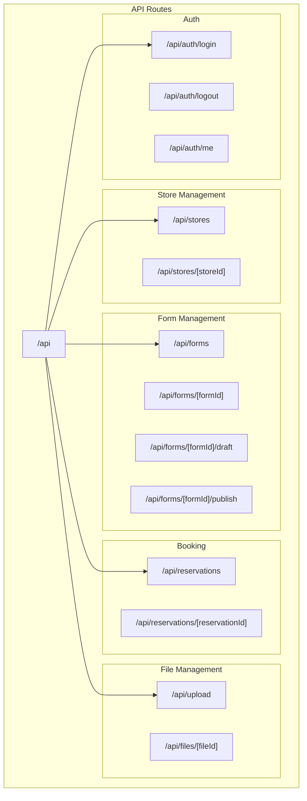

### Supabase Database設計
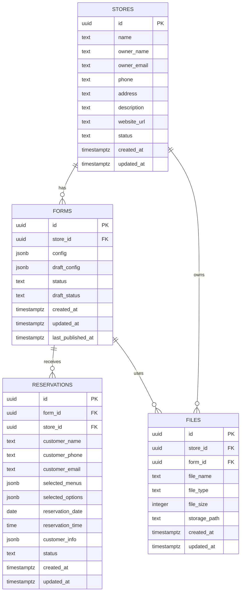

## 🔐 認証・認可設計

### Supabase Auth設計
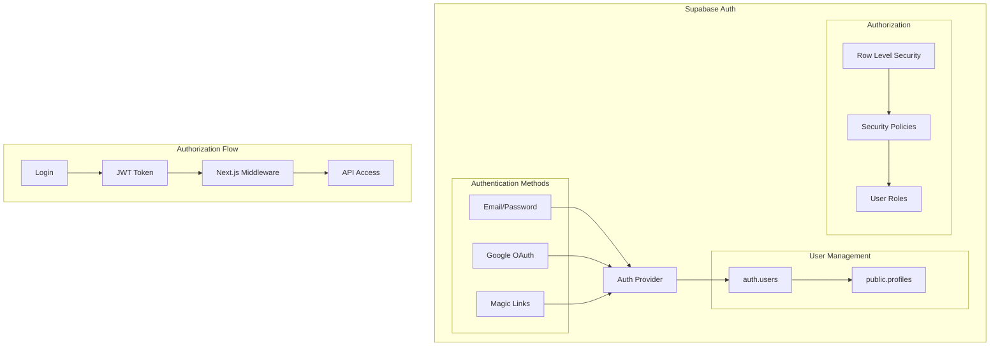

### Row Level Security設計
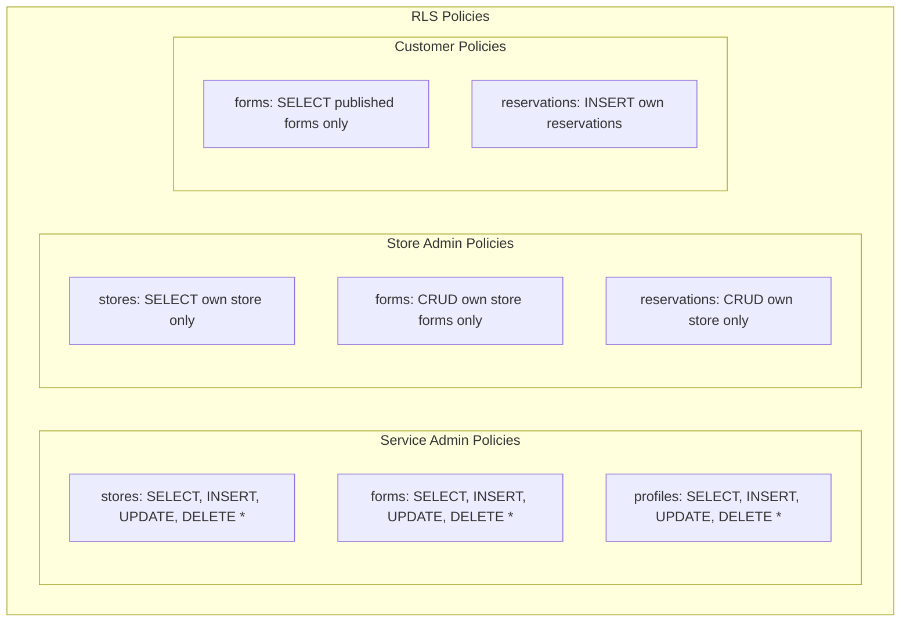

## 🏢 開発環境設計

### 開発環境構成
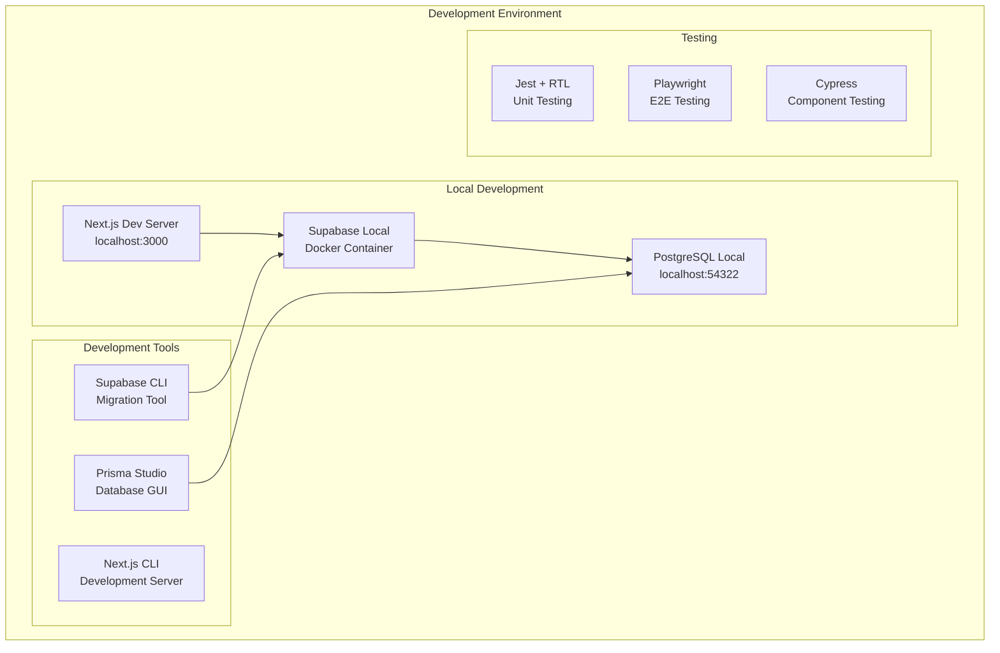

### 環境切り替え設計
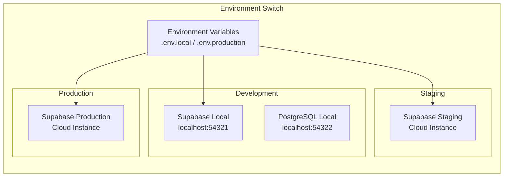

## 🚀 本番環境設計

### Vercel + Supabase環境構成
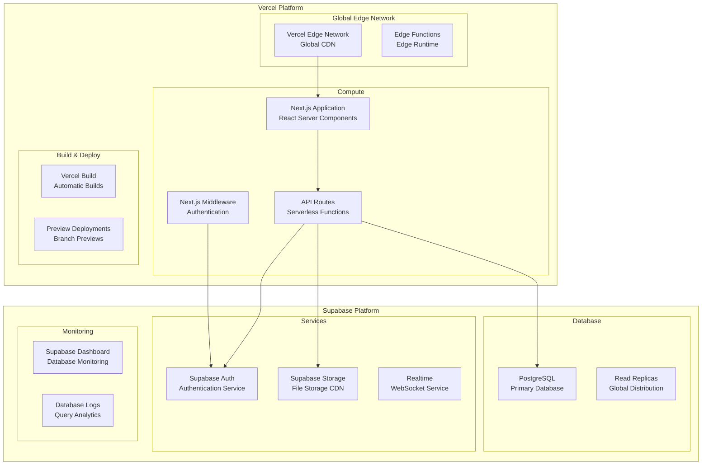

### Infrastructure as Code (Supabase)
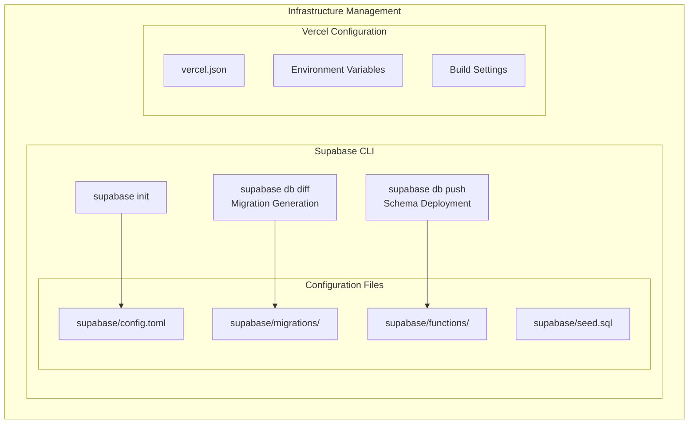

## 📦 CI/CD設計

### デプロイメントパイプライン
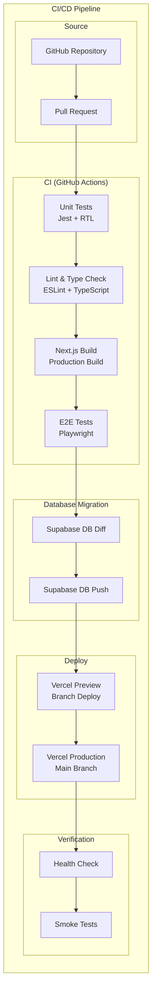

### 環境戦略
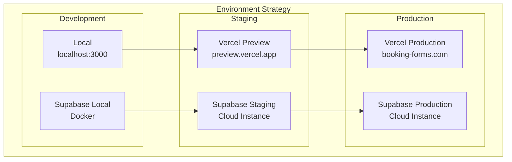

## 📊 監視・ログ設計

### 監視アーキテクチャ
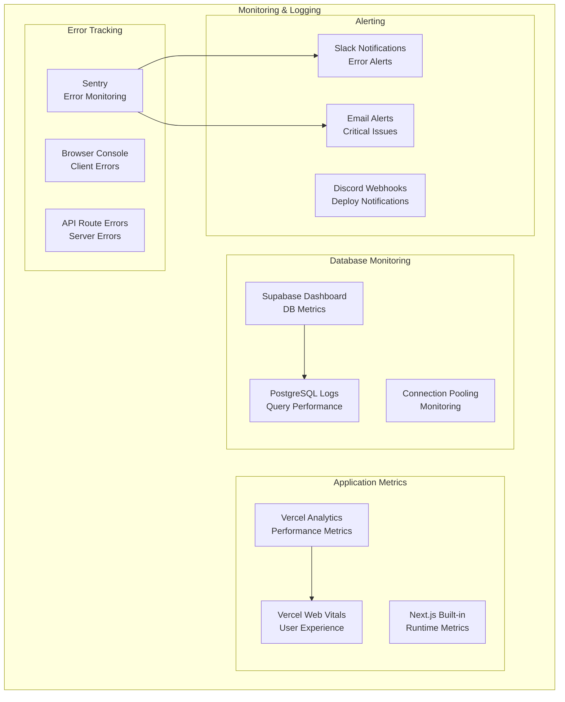

## 🔒 セキュリティ設計

### セキュリティ層
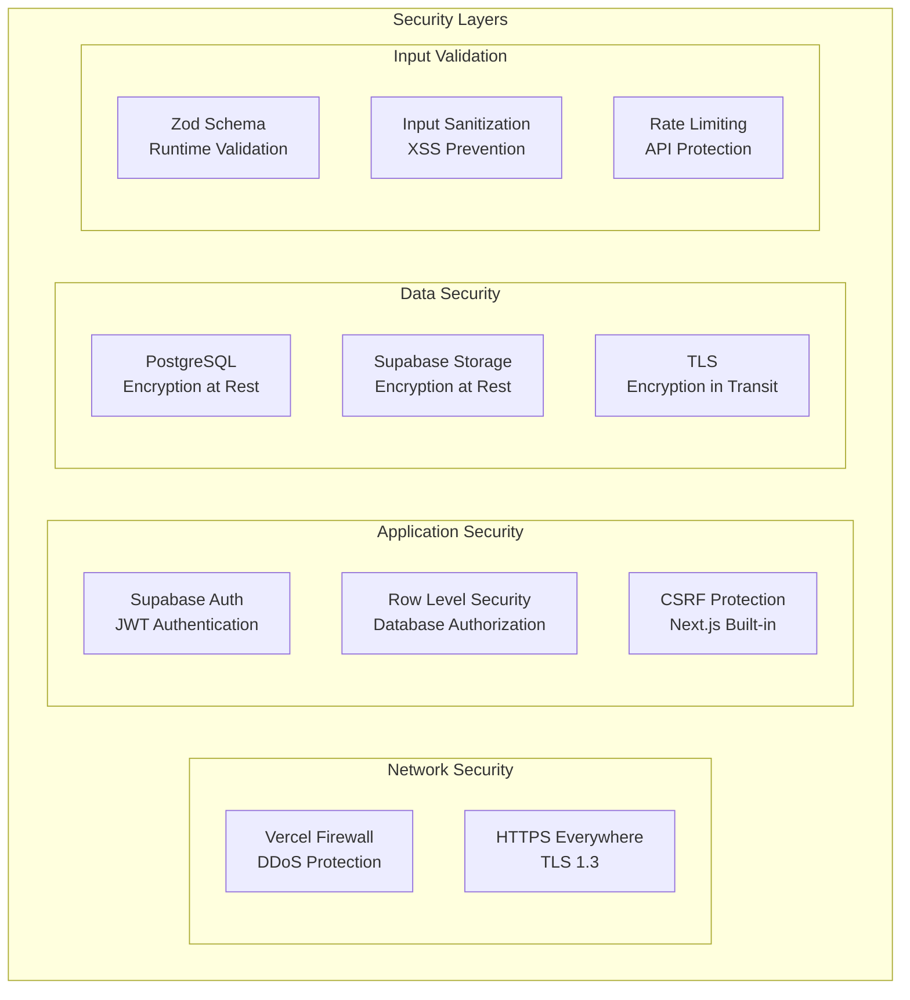

## 📈 スケーラビリティ設計

### 自動スケーリング
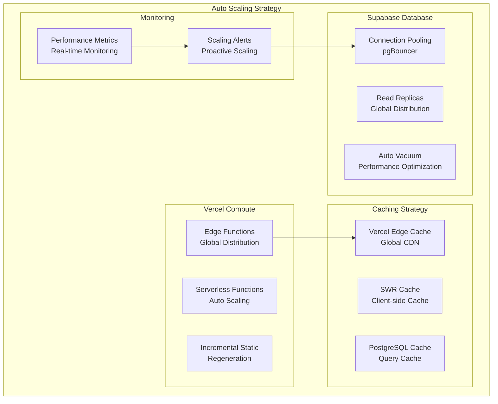

この技術設計書により、Next.js + Supabaseを活用した実用的でスケーラブルなアーキテクチャで開発を進められます。従来のAWS構成と比較して、開発効率が大幅に向上し、運用負荷も軽減されます。
