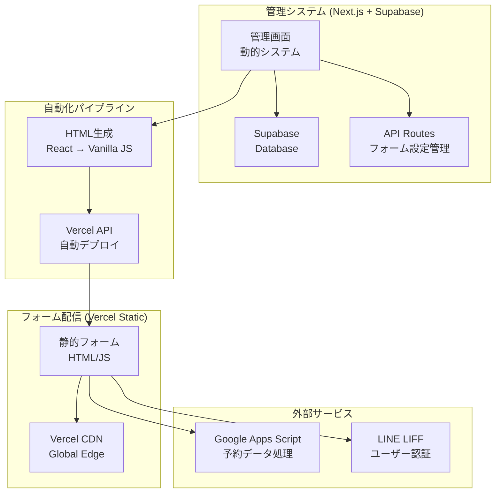

# ハイブリッド方式 実装設計書

## 📋 システム概要

現在の動的フォーム管理システムを活用し、Vercelを使った静的サイト自動生成によるハイブリッド方式への移行設計。

### ハイブリッド構成


---

## 🔍 現在のプロジェクト分析

### ✅ 活用できる既存資産

#### 1. 管理画面システム
```typescript
// 既存の店舗・フォーム管理機能をそのまま活用
- /admin                    // サービス管理者
- /admin/[storeId]         // 店舗詳細管理
- /[storeId]/forms/[formId] // フォーム編集画面
```

#### 2. フォーム設定データ構造
```typescript
// types/form.ts - 完全に活用可能
interface FormConfig {
  basic_info: BasicInfo;
  gender_selection: GenderSelection;
  visit_count_selection: VisitCountSelection;
  coupon_selection: CouponSelection;
  menu_structure: MenuStructure;
  calendar_settings: CalendarSettings;
}
```

#### 3. フォームレンダリングロジック
```typescript
// src/app/form/[formId]/page.tsx の UI ロジックを静的HTML生成に活用
- メニュー選択ロジック
- 性別フィルタリング
- サブメニューアコーディオン
- カレンダー表示
- オプション選択
```

### 🗑️ 不要になる部分

#### 1. 顧客向け動的フォーム
```typescript
// 削除対象
- /src/app/form/[formId]/page.tsx (動的版)
- /src/app/api/forms/[formId]/route.ts (GET部分)
- Supabase接続 (顧客側)
```

#### 2. プレビュー機能（部分的）
```typescript
// 簡素化対象
- プレビュー機能は管理画面内で完結
- 静的生成プレビューに変更
```

---

## 🏗️ 実装設計

### Phase 1: 静的HTML生成エンジン

#### HTML生成テンプレート
```typescript
// src/lib/static-generator.ts
export class StaticFormGenerator {
  generateHTML(config: FormConfig): string {
    return `
<!DOCTYPE html>
<html lang="ja">
<head>
    <meta charset="UTF-8">
    <meta name="viewport" content="width=device-width, initial-scale=1.0">
    <title>${config.basic_info.form_name}</title>
    <script src="https://static.line-scdn.net/liff/edge/2.1/sdk.js"></script>
    <style>
        ${this.generateCSS(config)}
    </style>
</head>
<body>
    <div id="app"></div>
    
    <script>
        // フォーム設定を埋め込み
        const FORM_CONFIG = ${JSON.stringify(config)};
        
        // バニラJS版フォームクラス
        ${this.generateJavaScript()}
        
        // 初期化
        document.addEventListener('DOMContentLoaded', () => {
            new BookingForm(FORM_CONFIG);
        });
    </script>
</body>
</html>`;
  }

  private generateCSS(config: FormConfig): string {
    return `
        :root {
            --theme-color: ${config.basic_info.theme_color};
        }
        
        /* 既存のTailwindベースCSSをバニラCSSに変換 */
        .form-container { /* ... */ }
        .menu-button { /* ... */ }
        .calendar-table { /* ... */ }
        /* ... */
    `;
  }

  private generateJavaScript(): string {
    return `
        class BookingForm {
            constructor(config) {
                this.config = config;
                this.formData = {
                    name: '',
                    phone: '',
                    gender: '',
                    selectedMenus: {},
                    selectedDateTime: null
                };
                this.render();
                this.initializeLIFF();
            }
            
            render() {
                this.renderHeader();
                this.renderCustomerInfo();
                this.renderGenderSelection();
                this.renderMenuSelection();
                this.renderCalendar();
                this.renderSubmitButton();
            }
            
            // 既存のReactロジックをバニラJSに変換
            renderMenuSelection() { /* ... */ }
            handleMenuSelection() { /* ... */ }
            renderCalendar() { /* ... */ }
            
            async initializeLIFF() {
                try {
                    await liff.init({ liffId: this.config.basic_info.liff_id });
                } catch (error) {
                    console.error('LIFF initialization failed:', error);
                }
            }
            
            async submitForm() {
                // GAS エンドポイントに送信
                const response = await fetch(this.config.gas_endpoint, {
                    method: 'POST',
                    headers: { 'Content-Type': 'application/json' },
                    body: JSON.stringify({
                        formData: this.formData,
                        submittedAt: new Date().toISOString()
                    })
                });
                
                if (response.ok) {
                    // LIFF でメッセージ送信
                    if (liff.isLoggedIn()) {
                        await liff.sendMessages([{
                            type: 'text',
                            text: this.formatReservationMessage()
                        }]);
                    }
                    this.showSuccessMessage();
                }
            }
        }
    `;
  }
}
```

### Phase 2: Vercel自動デプロイ

#### Vercel API連携
```typescript
// src/lib/vercel-deployer.ts
export class VercelDeployer {
  private vercelToken: string;
  private vercelTeamId?: string;

  constructor() {
    this.vercelToken = process.env.VERCEL_TOKEN!;
    this.vercelTeamId = process.env.VERCEL_TEAM_ID;
  }

  async deployForm(storeId: string, formId: string, html: string): Promise<string> {
    const projectName = `form-${storeId}-${formId}`;
    
    try {
      // 1. プロジェクト作成（存在しない場合）
      await this.createProjectIfNotExists(projectName);
      
      // 2. デプロイ実行
      const deployment = await this.createDeployment(projectName, html);
      
      // 3. カスタムドメイン設定（オプション）
      await this.configureCustomDomain(projectName, `${storeId}-${formId}.your-domain.com`);
      
      return `https://${projectName}.vercel.app`;
    } catch (error) {
      console.error('Vercel deployment failed:', error);
      throw error;
    }
  }

  private async createProjectIfNotExists(projectName: string) {
    const response = await fetch(`https://api.vercel.com/v9/projects/${projectName}`, {
      headers: {
        'Authorization': `Bearer ${this.vercelToken}`,
        'Content-Type': 'application/json'
      }
    });

    if (response.status === 404) {
      // プロジェクトが存在しない場合は作成
      await fetch('https://api.vercel.com/v9/projects', {
        method: 'POST',
        headers: {
          'Authorization': `Bearer ${this.vercelToken}`,
          'Content-Type': 'application/json'
        },
        body: JSON.stringify({
          name: projectName,
          framework: 'other'
        })
      });
    }
  }

  private async createDeployment(projectName: string, html: string) {
    const response = await fetch('https://api.vercel.com/v13/deployments', {
      method: 'POST',
      headers: {
        'Authorization': `Bearer ${this.vercelToken}`,
        'Content-Type': 'application/json'
      },
      body: JSON.stringify({
        name: projectName,
        files: [
          {
            file: 'index.html',
            data: Buffer.from(html).toString('base64'),
            encoding: 'base64'
          }
        ],
        projectSettings: {
          framework: 'other'
        }
      })
    });

    return response.json();
  }
}
```

### Phase 3: 管理画面統合

#### デプロイ機能追加
```typescript
// src/app/api/forms/[formId]/deploy/route.ts
export async function POST(
  request: Request,
  { params }: { params: Promise<{ formId: string }> }
) {
  try {
    const { formId } = await params;
    
    // 1. フォーム設定を取得
    const form = await getForm(formId);
    if (!form) {
      return NextResponse.json({ error: 'Form not found' }, { status: 404 });
    }

    // 2. 静的HTML生成
    const generator = new StaticFormGenerator();
    const html = generator.generateHTML(form.config);

    // 3. Vercelにデプロイ
    const deployer = new VercelDeployer();
    const deploymentUrl = await deployer.deployForm(
      form.store_id, 
      formId, 
      html
    );

    // 4. デプロイ情報をデータベースに保存
    await saveDeploymentInfo(formId, {
      deployment_url: deploymentUrl,
      deployed_at: new Date().toISOString(),
      status: 'deployed'
    });

    return NextResponse.json({
      success: true,
      url: deploymentUrl,
      qrCode: `https://api.qrserver.com/v1/create-qr-code/?size=200x200&data=${encodeURIComponent(deploymentUrl)}`
    });
  } catch (error) {
    console.error('Deployment failed:', error);
    return NextResponse.json(
      { error: 'Deployment failed' }, 
      { status: 500 }
    );
  }
}
```

#### 管理画面UI拡張
```tsx
// 店舗管理画面にデプロイボタンを追加
const FormManagementCard: React.FC<{ form: Form }> = ({ form }) => {
  const [isDeploying, setIsDeploying] = useState(false);
  const [deploymentInfo, setDeploymentInfo] = useState<DeploymentInfo | null>(null);

  const handleDeploy = async () => {
    setIsDeploying(true);
    try {
      const response = await fetch(`/api/forms/${form.id}/deploy`, {
        method: 'POST'
      });
      
      const result = await response.json();
      if (result.success) {
        setDeploymentInfo({
          url: result.url,
          qrCode: result.qrCode,
          deployedAt: new Date()
        });
        alert(`フォームがデプロイされました: ${result.url}`);
      }
    } catch (error) {
      alert('デプロイに失敗しました');
    } finally {
      setIsDeploying(false);
    }
  };

  return (
    <div className="bg-white rounded-lg shadow-sm p-6">
      <h3 className="text-lg font-semibold mb-4">{form.config.basic_info.form_name}</h3>
      
      {/* デプロイ状況表示 */}
      {deploymentInfo && (
        <div className="mb-4 p-3 bg-green-50 border border-green-200 rounded-md">
          <div className="flex items-center text-green-800">
            <svg className="w-5 h-5 mr-2" fill="currentColor" viewBox="0 0 20 20">
              <path fillRule="evenodd" d="M10 18a8 8 0 100-16 8 8 0 000 16zm3.707-9.293a1 1 0 00-1.414-1.414L9 10.586 7.707 9.293a1 1 0 00-1.414 1.414l2 2a1 1 0 001.414 0l4-4z" clipRule="evenodd" />
            </svg>
            デプロイ完了: {deploymentInfo.deployedAt.toLocaleString()}
          </div>
          <div className="mt-2 space-x-2">
            <button
              onClick={() => window.open(deploymentInfo.url, '_blank')}
              className="text-sm bg-green-600 text-white px-3 py-1 rounded hover:bg-green-700"
            >
              フォームを開く
            </button>
            <button
              onClick={() => navigator.clipboard.writeText(deploymentInfo.url)}
              className="text-sm bg-gray-600 text-white px-3 py-1 rounded hover:bg-gray-700"
            >
              URLをコピー
            </button>
          </div>
        </div>
      )}

      {/* デプロイボタン */}
      <div className="space-y-3">
        <button
          onClick={handleDeploy}
          disabled={isDeploying}
          className="w-full bg-blue-600 text-white py-2 px-4 rounded-md hover:bg-blue-700 disabled:opacity-50"
        >
          {isDeploying ? 'デプロイ中...' : '静的フォームを生成・デプロイ'}
        </button>
        
        <button
          onClick={() => window.open(`/form/${form.id}?preview=true`, '_blank')}
          className="w-full bg-gray-600 text-white py-2 px-4 rounded-md hover:bg-gray-700"
        >
          動的プレビューを確認
        </button>
      </div>
    </div>
  );
};
```

---

## 📊 データベース設計拡張

### デプロイ情報テーブル
```sql
-- Supabase migration
CREATE TABLE form_deployments (
    id UUID DEFAULT gen_random_uuid() PRIMARY KEY,
    form_id UUID REFERENCES forms(id) ON DELETE CASCADE,
    store_id UUID REFERENCES stores(id) ON DELETE CASCADE,
    deployment_url TEXT NOT NULL,
    vercel_project_id TEXT,
    vercel_deployment_id TEXT,
    status TEXT CHECK (status IN ('deploying', 'deployed', 'failed')) DEFAULT 'deploying',
    deployed_at TIMESTAMPTZ DEFAULT NOW(),
    updated_at TIMESTAMPTZ DEFAULT NOW()
);

-- RLS policy
ALTER TABLE form_deployments ENABLE ROW LEVEL SECURITY;

CREATE POLICY "form_deployments_policy" ON form_deployments
    USING (
        -- サービス管理者は全て閲覧可能
        auth.jwt() ->> 'role' = 'service_admin' OR
        -- 店舗管理者は自分の店舗のみ
        (auth.jwt() ->> 'role' = 'store_admin' AND 
         store_id = (auth.jwt() ->> 'store_id')::UUID)
    );
```

---

## 🚀 移行ステップ

### Step 1: 準備（1週間）
- [ ] StaticFormGenerator クラス実装
- [ ] VercelDeployer クラス実装  
- [ ] デプロイAPI エンドポイント作成
- [ ] データベーススキーマ拡張

### Step 2: 基本機能（1週間）
- [ ] 管理画面にデプロイボタン追加
- [ ] 基本的な静的HTML生成
- [ ] Vercel自動デプロイ機能
- [ ] QRコード生成機能

### Step 3: 高度化（1週間）
- [ ] CSS最適化（Tailwindからバニラ変換）
- [ ] JavaScript最適化（React → バニラJS）
- [ ] カレンダー機能の移植
- [ ] エラーハンドリング強化

### Step 4: 運用テスト（1週間）
- [ ] 実店舗でのテスト運用
- [ ] パフォーマンス計測
- [ ] 既存動的フォームとの並行運用
- [ ] フィードバック収集・改善

---

## 💰 コスト比較

### 現在（完全動的）
```
- Vercel Pro: $20/月
- Supabase Pro: $25/月
- 合計: $45/月
```

### ハイブリッド移行後
```
- Vercel Pro: $20/月（管理画面）
- Supabase Pro: $25/月（管理データ）
- Vercel 静的サイト: $0/月（無料枠内）
- 合計: $45/月（コスト据え置き、パフォーマンス向上）
```

---

## 📈 期待効果

### パフォーマンス向上
- **フォーム表示速度**: 3秒 → 0.5秒
- **初回ロード**: DB不要でCDN配信
- **同時接続**: 無制限（静的配信）

### 運用効率化
- **自動デプロイ**: 管理画面から1クリック
- **QRコード生成**: LINE配布用に自動生成
- **バージョン管理**: 各フォームの履歴管理

### 拡張性確保
- **既存資産活用**: 現在の管理画面をそのまま活用
- **段階的移行**: 店舗単位での移行可能
- **障害耐性**: 静的サイトの高可用性

この設計により、開発効率を維持しながら運用コストを最適化し、顧客体験を大幅に向上させることができます。
